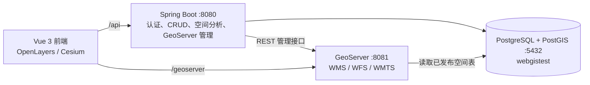

# WebGIS 全栈学习项目

这是一个把 **Web 地图展示、空间数据管理和空间分析** 放在一起的学习型全栈项目。

- 前端使用 Vue 3，分别用 OpenLayers 演示二维地图、用 Cesium 演示三维地球。
- 后端使用 Spring Boot，提供认证、空间表 CRUD、JTS/pgRouting 空间分析，以及 GeoServer 管理代理接口。
- PostgreSQL/PostGIS 保存业务和空间数据；GeoServer 将空间表发布为 WMS、WFS、WMTS 等地图服务。

## 架构与数据流



前端开发服务器会把 `/api` 转发到后端 `:8080`，把 `/geoserver` 转发到 GeoServer `:8081`。因此，完整演示通常需要四个服务都启动。

## 当前内容

| 模块 | 内容 |
| --- | --- |
| OpenLayers 纯前端 | 6 个二维地图基础学习页面。 |
| OpenLayers 全栈 | 6 个页面：GeoServer 服务、WFS-T、空间编辑、数据管理、样式和空间分析。 |
| Cesium 纯前端 | 19 个三维地图学习页面。 |
| Cesium 全栈 | 3 个页面：GeoServer 的 WMS/WMTS/WFS 接入、PostGIS CRUD、服务端空间分析与路径。 |
| GeoServer 配置包 | `geoserver/config` 保存可重复应用的 `webgistest` 目录配置与 SLD 样式。 |
| 数据库备份 | `data/webgistest-2026-08-03.sql` 是可用 `psql` 恢复的文本 SQL 备份。 |

## 目录

```text
Webgis-fullStack/
├── .agents/                 项目级 Agent skills
├── .claude/                 Claude Code 配置、skills 和 plans
├── .codex/                  Codex 项目级 hooks 配置
├── .github/                 GitHub 自动化配置
├── frontend/                Vue 3 + Vite + OpenLayers + Cesium
├── backend/                 Spring Boot + MyBatis-Plus + GeoTools
├── geoserver/               GeoServer 配置同步包与 Data Directory 备份
├── data/                    PostgreSQL SQL 备份
├── deploy/                  Docker Compose 部署文件和初始化脚本
├── docs/                    项目经验、设计和计划文档
├── .claudeignore            Claude 无需读取的文件清单
├── .gitignore               Git 忽略规则
├── .gitattributes           Git 文件属性规则
└── AGENTS.md                项目整体上下文和协作约定
```

## 前置软件

在 Windows 本地开发时，请先准备：

- Node.js 与 npm（前端依赖安装和 Vite 启动）。
- JDK 17 和 Maven（Spring Boot 后端）。
- PostgreSQL + PostGIS（默认端口 `5432`）。
- GeoServer 2.26.1，且具备 PostGIS 数据存储支持（默认端口 `8081`）。

本机配置的默认服务端口如下：

| 服务 | 地址 |
| --- | --- |
| 前端 | `http://localhost:5173` |
| 后端健康检查 | `http://localhost:8080/api/health` |
| GeoServer 管理页 | `http://localhost:8081/geoserver/web/` |
| PostgreSQL | `localhost:5432` |

## 首次启动

按下面顺序启动，最容易定位问题：数据库 → GeoServer → 后端 → 前端。

### 1. 创建并恢复数据库

先确认 PostgreSQL 已启动。首次创建空数据库后，在项目根目录执行：

```powershell
& 'C:\SoftWare\PostgreSQL\17\bin\createdb.exe' `
  -h localhost -p 5432 -U postgres -W webgistest

& 'C:\SoftWare\PostgreSQL\17\bin\psql.exe' `
  -h localhost -p 5432 -U postgres -W -d webgistest `
  -f '.\data\webgistest-2026-08-03.sql'
```

如果数据库已经存在，**不要重复执行创建命令**。若需要从头恢复，应先在确认目标无用后自行删除/重建数据库，再执行第二条命令。

后端数据库地址和 GeoServer 地址目前在 [`backend/src/main/resources/application.yml`](backend/src/main/resources/application.yml) 中配置。不要把真实密码、JWT 密钥或 GeoServer 管理员凭据提交到远程仓库。

### 2. 启动并配置 GeoServer

先启动 GeoServer，确认能打开管理页。然后把当前 PowerShell 窗口中的数据库连接信息交给配置脚本：

```powershell
$env:GEOSERVER_DATASTORE_HOST = 'localhost'
$env:GEOSERVER_DATASTORE_PORT = '5432'
$env:GEOSERVER_DATASTORE_DATABASE = 'webgistest'
$env:GEOSERVER_DATASTORE_USER = 'postgres'
$env:GEOSERVER_DATASTORE_PASSWORD = '填写 PostgreSQL 密码'

& .\geoserver\apply.ps1 `
  -GeoServerUrl 'http://localhost:8081/geoserver' `
  -WhatIf
```

`-WhatIf` 只打印计划，不会创建任何 GeoServer 资源。确认输出后，去掉 `-WhatIf` 再执行一次即可真正应用 `webgistest` 工作空间、数据存储、图层和样式。

完整说明见 [`geoserver/README.md`](geoserver/README.md)。不要直接解压并覆盖正在运行的 Data Directory；`GeoServer.zip` 是完整备份，和可同步的 `config/` 不是同一种东西。

### 3. 启动后端

```powershell
cd .\backend
mvn spring-boot:run
```

确认浏览器或终端访问 `http://localhost:8080/api/health` 能得到成功响应。编译和测试命令：

```powershell
mvn compile
mvn test
```

### 4. 启动前端

另开一个 PowerShell：

```powershell
cd .\frontend
npm install
npm run dev
```

打开 `http://localhost:5173`。前端构建和测试命令：

```powershell
npm run build
npm run test
```

## 最小检查顺序

遇到页面没有地图或全栈课程不可用时，按依赖方向检查：

1. `http://localhost:8080/api/health`：后端是否启动。
2. GeoServer 管理页是否可访问，且存在 `webgistest` 工作空间和相应图层。
3. PostgreSQL 是否在 `5432` 监听，且 `webgistest` 存在空间表。
4. 浏览器开发者工具的 Network：`/api` 应走后端，`/geoserver` 应走 GeoServer。

纯前端 Cesium 课程可在不启动后端的情况下学习；所有“全栈”课程都依赖后端，GeoServer 服务课程还依赖 GeoServer 与 PostGIS。

## 进一步阅读

- [前端工程说明](frontend/AGENTS.md)
- [后端工程说明](backend/CLAUDE.md)
- [GeoServer 配置同步与备份说明](geoserver/README.md)
- [项目经验索引](docs/memory/MEMORY.md)

## Docker 部署（可选）

项目提供 Docker Compose 部署文件，主要用于 Linux 虚拟机或服务器；本地开发仍建议按上面的前后端、PostgreSQL 和 GeoServer 流程分别启动。

首次部署时，在项目根目录执行：

```bash
cp deploy/.env.example deploy/.env
# 编辑 deploy/.env，填写数据库密码、JWT 密钥和 GeoServer 管理员密码
docker compose --env-file deploy/.env -f deploy/compose.yaml up -d --build
```

Compose 会自动构建项目镜像、启动数据库和 GeoServer，并在空数据卷中导入 SQL 与恢复 `GeoServer.zip`。详细部署说明见 [`deploy/README.md`](deploy/README.md)。
